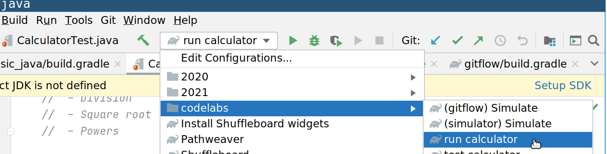
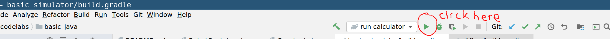
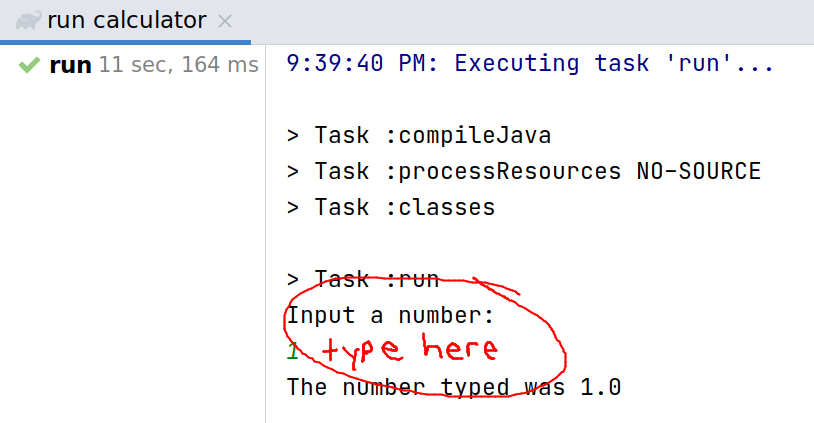
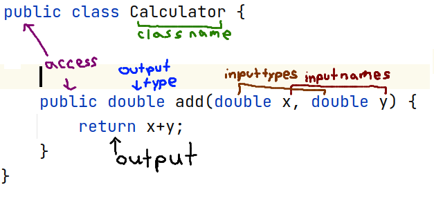

.. _basic-java-lab:

Calculator Lab
==============

In this lab, you will implement and test a command-line calculator app. 

Unlike most of the code you will work with in GoS, you should be able to understand the majority of this code. 

The project code is located in the monorepo: https://github.com/GirlsOfSteelRobotics/GirlsOfSteelMonoRepo in the codelabs/basic_java folder. 

Part One
________

1. Run the existing calculator
------------------------------
One function (add) has been implemented for you. Select "run calculator" (shown in the menu screenshot below) and click the green play button to run the calculator (also shown in a screenshot below)

At the bottom of the screen, follow the prompts to add 2 numbers and print the result. 

What happens?

2. Find the file you just ran
-----------------------------
Code files are generally in :code:`src`, though often nested in many layers of folders.  You can find this one in :code:`codelabs/basic_java/src/main/java/com/gos/codelabs/basic_java` 

Read the file. Look for the main method, which is anything between the curly brackets in :code:`public static void main(String[] args)`
It's okay if you don't know what all of those words mean yet. It basically means the class has a function 
available outside of it that does not output anything. The image below breaks the components down. 

Although there are nicer ways of doing this, the simplest way to build a string is to use a :code:`+` operator 
between the strings. 
Example: :code:`"The number"  + "typed was"`
Find the line in the code that caused `"The number typed was"` to be printed to the screen.

3. Edit the line printed. 
-------------------------
Change the line in the code to anything else. For example, to print `Alex typed in the number`

4. Create a calculator object
-----------------------------
Java uses objects, which are structures that contain data and perform functions.
More details: https://docs.oracle.com/javase/tutorial/java/concepts/index.html

In Java, the syntax (pattern of typing code that can be read by what builds it) of creating an object is
:code:`Object nameOfMyObject = new Object()`
The parentheses go around the inputs to the object, which in this example is empty. 
We have one object being made in the file already. 
:code:`Scanner input = new Scanner(System.in);`
A scanner is an object that reads in text from a prompt. 

The object you will create is a :code:`Calculator`. Follow the pattern above to create a :code:`Calculator`
called `myCalculator`.

5. Use the add function of the calculator
-----------------------------------------
Objects can call methods, which are functions that operate on inputs. We call the inputs arguments. 
To call a function, type a dot after the object name, and then put the inputs in the parentheses. 
:code:`myCalculator.add(3,4)`

Try adding 5+6 using myCalculator. Print out the result. 

6. Find Calculator.java
-----------------------
Find the Calculator.java file. Look at the structure. What are the functions it already has? 
Where is the add function?

Let's understand what the functions mean. 
:code:`public` means the function can be accessed anywhere. It is the least restrictive type of access. The opposite is :code:`private`
:code:`double` means a computer's approximation of a real number, with decimals. Ex) 4.563201 is best represented using a double. 

7. Add functions to Calculator.java
-----------------------------------
Following the pattern of :code:`add` add more useful functions to :code:`Calculator.java`. Java operators are similar 
to what you use on your graphing calculator. Ex:

1. subtract: x-y

2. multiply: x*y

3. divide: x/y

Bonus: Call your functions in RunCalculator.java 
------------------------------------------------
This can potentially be a challenging exercise as it involves putting together several concepts
If you find yourself stuck, either ask for help from your fellow students, mentors, or move onto the Part 2 and come back later. 
Useful concepts:

1. :code:`charAt(0)` outputs the 0th (first) character of a string of characters. You can use it to read a character from the input

2. conditions: a statement that is either true or false. To check equality, Java uses two equal signs :code:`(==)` Ex)

3. :code:`(3 == 4)` a false statement

4. :code:`(4 == 4)` a true statement

5. :code:`('a' == 'b')` a false statement

6. if statement: run the code inside the brackets if the condition in the parentheses is true

There is some sample code in the :code:`TODO` that might be helpful.

Part Two
________
Tests are a useful way of making sure the code is working properly. We use 
:code:`assert` statement that checks whether the condition in the parentheses is true.
If it is not, it throws an error. Why might this be useful for checking if our code is working?

1. Find CalculatorTest.java.  
----------------------------
You can find it in your IDE. If you prefer, you can also use Windows Explorer or Mac Finder to find this file. 
Run "test calculator" from the menu above

.. image:: images/test_calculator_tree.png

2. Make a test fail
-------------------
Look at the result in the bottom window. Try to make the test fail. Then change it back.

3. Test your subtraction method
-------------------------------
Follow the pattern in :code:`testAddition` in :code:`testSubtraction`
to test your subtract method. Make sure it passes.

4. Test your other methods
--------------------------
Write tests for the other functions you wrote.  

