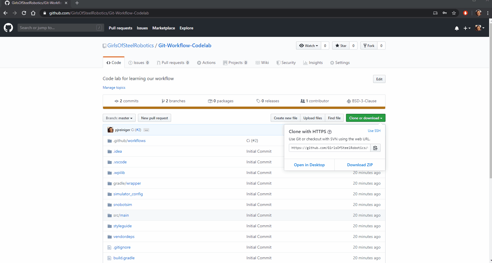

.. _gitflow-lab:

Gitflow Lab
===========

This lab will walk you through our workflow, from creating branches through merging a pull request.

Here is the project we will be using https://github.com/GirlsOfSteelRobotics/Git-Workflow-Codelab

Part One
________

1. Clone and open the project
-----------------------------
|gitflow-import|

2. Checkout a new branch
------------------------
IMPORTANT: For this code lab, you will base your branch off of something other than master. This is to force a merge coflict later in the lab. 99.9% of the time you are developing real code from the robot, you would start off of master

Base the branch off of origin/codelab_start, and name it something like <your name>_codelab_part1

3. Create a new Subsystem
-------------------------
Create it with the name "<your name>Codelab<year>Part1", ex. :code:`PJCodelab2020Part1`

4. Put a print line in the constructor
--------------------------------------
Something along the line of "<name> says hello world in <year> part 1"

5. Create your command
----------------------
In :code:`RobotContainer`, declare your subsystem.

6. Run SnobotSim
----------------
Run it from the run configurations area, and make sure your string gets printed out

7. Commit, Push, Create PR
--------------------------
You will notice that the you cannot merge your branch, because there is a conflict

8. Fix conflict, re-push
------------------------
After the push, add PJ or Joe as a reviewer, and ping them in Slack to review and approve the PR

Part Two
________
Part two is meant to make sure you run the cleanup proces correctly, and can create your next feature branch.

Re-run steps 2-7, but replace any references to "part1" with "part2"

