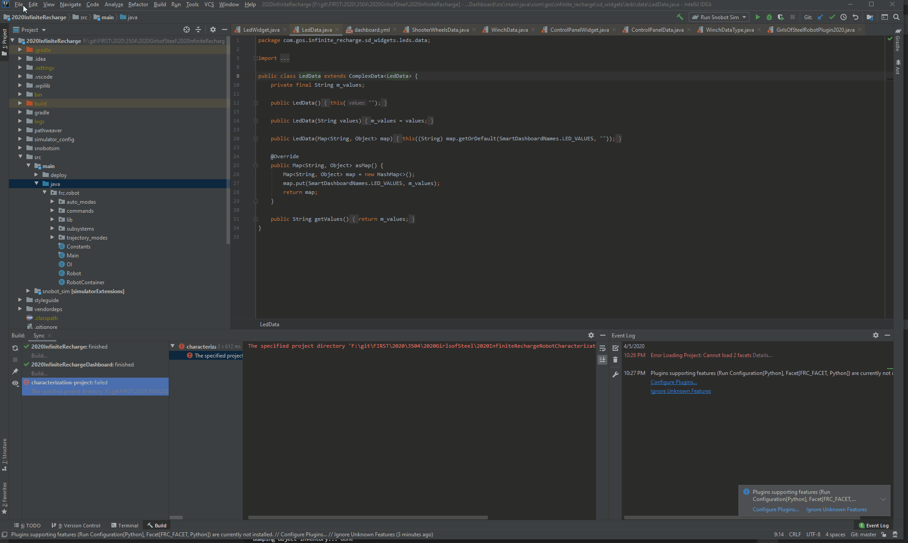
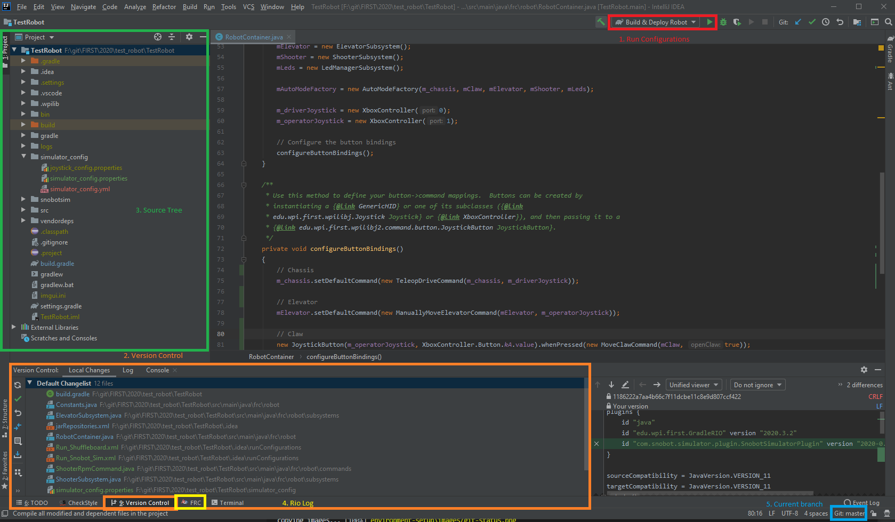
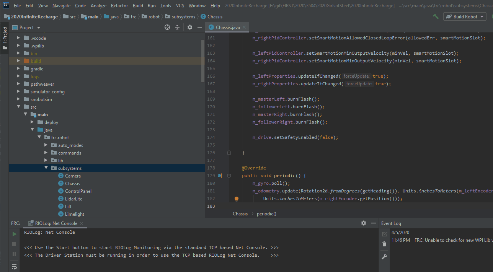
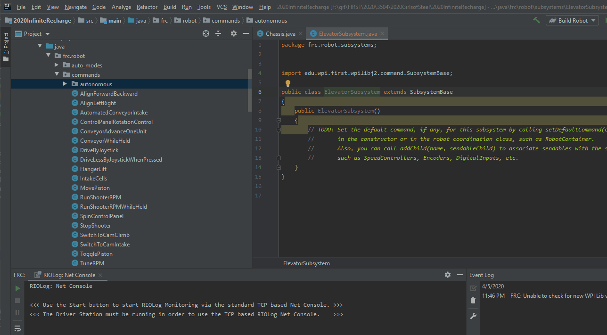

.. intellij:

Intellij Setup
================

Intellij is an IDE specifically built for writing Java software. Because it is a first class Java editor, it 
offers much better support than the versions of VS Code that WPI provides us.

Installing Intellij
-------------------
The easiest way to install and update Intellij is by download Jet Brains Toolbox_ application. This will alert you
whenever there is a new version, and allows you to easily download their other IDEs if you ever want to dabble
in Python or Web Development

Once Toolbox has been installed, open it and select the "Intellij Community Edition", and run the installer

Installing Plugins
------------------
To get the best experience out of Intellij, we need to install some additional plugins.

To install a plugin, go to "File -> Settings -> Plugins". Select the "Marketplace" for the following plugins, and install them. Once they are all done, you will need to restart Intellij

- FRC
- Checkstyle-IDEA

|intellij-plugin-setup|

Navigating Intellij
-------------------
When you open intellij, you will see a screen that looks like this.

|intellij-markup|

1. Run Configurations
_____________________
The options in this dropdown allow you to do all of the important things we could do in VS code like deploying code
to the robot, opening the RioLog, as well as allowing you to run the simulator. 

*Note*: unlike VS code, you have to select what you want to run AND THEN press the green play button, they don't auto run when selected like in VS Code.

2. Version Control
__________________
The version control tab allows you to see your current changes, easily look at diffs at a quick glance, and kick off 
the commit/push process. There are a lot more options available in the "VCS -> Git" toolbar on the top.

3. Source Tree
______________
This is where we can see all of the files for our project. Unlike VS Code, you have to manually open folders that
have only one subfolder in them which can be a little bit more tedious. Our robot code is located under 
the "src/main/java/frc.robot" folders

4. FRC Tab / RioLog
___________________
When you are connected and communicating with the robot, the RioLog will be displayed here

FRC Plugin
----------

The Intellij FRC plugin is an open source project to provide a lot of helpful features for us when we are developing software
for FRC robots. It eases the creation of Subsytems and Commands by filling in a lot of the boiler plate code for use.

Adding a Subsystem
__________________
Right click on the package where you want to put the subsystem (almost certainly :code:`frc.robot.subsystems`), and click "New -> FRC -> Subsystem"

The substem it creates is very sparse. At the very least, you will probably want to add a :code:`periodic` function

|intellij-create-subsytem|

Adding a Command
________________
Right click on the package where you want to put the command, and click "New -> FRC -> Command". You will be given
the option to select what subsystems this command requires to save you some typing.

|intellij-create-command|

.. _toolbox: https://www.jetbrains.com/toolbox-app/