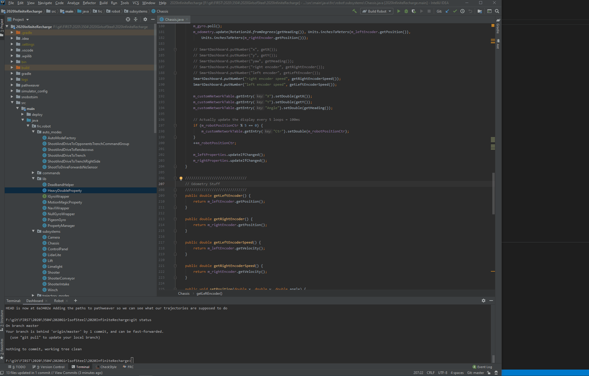

.. introduction:

Git-Flow Introduction
=====================

git was invented to solve the problem of many different people working on a project at the same time. 
Frequently we are working on tasks that we cannot finish in a single meeting, that we want to share 
with our fellow teammates. However, we do not want to commit something to master that will cause things to break.
We should strive to keep master in a 100% working, ready to deploy state.

One way to do this is to use a modified version of gitflow_, a very popular workflow used by many professional engineers
and companies. In essence, whenever we need to implement a new feature, or fix a bug, or really make any kind of change,
you create a branch off of master, do you work, then submit a "Pull Request" so we can pull your changes back into master.

Doing this allows each student / group of students working on a task to work in their own little sandbox. They can commit and
push their changes so they can bounce between computers and meetings, all without affecting all of the people working on other
tasks. 

Using Pull Requests gives us the opportunity to review a change before it gets into master, to make sure it follows
all of our coding conventions, the logic makes sense, and helps keep everyone knowledgeable about all of the things that are going
on in our software.

Scenario: I want to add a new feature
-------------------------------------
|intellij-commit-and-push|

1. Get Latest
_____________
Go to the toolbar and selecting "VCS -> Git -> Pull"

2. Create and Checkout a new branch
___________________________________
Click on the the git indicator on the bottom right. Click on "origin/master" 
under the remotes area, and select "New branch from selected". Enter your 
branch name in the popup, and hit "Checkout"

3. Start working!
_________________
You can now start adding / modifying / deleting files.

4. Commit work your work
Open the "Version Control" tab on the bottom of the screen. Navigate to the "Local Changes" tab. If there is anything 
under "Unversioned Files", drag that to "Default Changelist". Hit the green check mark, and type a commit message in
the popup. Finally hit the "Commit" button. Alternatively, you could change it to button to "Commit and Push"

Note: You can commit and push as frequently as you want. You should ALWAYS push at the end of the meeting, even if you haven't finished. This allows other students at the next meeting to continue working even if you aren't there.

5. Push your final commit
_________________________
When you are done with your feature, and have committed locally, you need to push it to GitHub. Depending on how you
ran step 4, you may have been automatically pushing. To run a push, go the the VCS menu and run "git -> push"

6. Create a Pull Request
________________________
There are many ways to create a pull request, the two easiest being from GitHub's website, or through intellij.

To create a PR on Github, open the repository in a web browser. Click on the branches tab, find your branch,
and click the "Create Pull Request" button. In the new window you can write an additional message for the PR
if you want, and then click the "Create Review" button.

To create a PR from intellij, go to "VCS -> git -> Create Pull Request". Create a title with a quick synopsis
of your feature, add any additional information in the description, and click OK

You should usually reference your :ref:`issues`. in your description.

7. Wait for Review and Approval
_______________________________
A :ref:`code-reviews` will happen for your code, which may require you making additional changes
before it gets put into master. You can follow steps 3-5 to just as you did before to create the branch.
Whenever you run a push, the code review will automatically get updated.

8. Run "Squash and Merge"
_________________________
Once the PR has been approved, one of the leaders will run a "Squash and Merge" to get your changes into master.
After the PR has been merged, your branch should be deleted.

9. Cleanup
__________
It is easy to make mistakes when you are are starting your next feature, so in order to avoid some of the confusion
we should clean up our now dead branch.

- Switch to master, and run a pull.
- Delete your local copy of your completed branch by going to it in the git indicator, clicking your branch
  under the "local" section, and selecting "Delete"
- Delete your remote copy by clicking on "origin/<your branch name" under the "Remotes" section

You are now on master, with the latest code, and no traces of the completed branch.

.. _gitflow: https://nvie.com/posts/a-successful-git-branching-model/