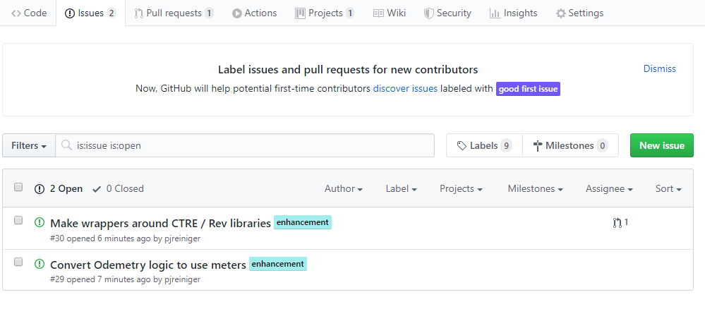

.. _issues:

Github Issue
============

We can use Issues on Github to track our task backlog. This is a good way to keep our TODO list in one place and assign tasks to the students that are working on them.
We can also link issues to pull requests, so we can have tracability to what this PR is for and vice versa.
|github-issues-page|

We can use a KanBan board to visualize which tasks are not being worked on / in progress / in review / done.
|github-issues-kanban|

