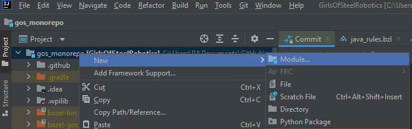

.. _create-new-robot-project:

Creating a New Robot Project
============================

Follow these steps to create a new robot project. This assumes that you have the FRC Intellij plugin installed

1. Create a new module
----------------------

From the file menu, do File -> New -> Module

2. Select the FRC Robot Project
-------------------------------

Note: , Ensure the most recent version of WPI Lib is selected

3. Select a template to start with. We use the Timed Robot template
-------------------------------------------------------------------

4. Set the team number and packge name
--------------------------------------

We want all of the projects in the monorepo to have a unique package name so we can differentiate 
them. All of our packages sould start with :code:`com.gos`. For a robot project, the next chunk should 
be the game name, in snake_case. i.e. :code:`infinite_recharge`, :code:`power_up`, etc

5. Select where the project should live
---------------------------------------

We group our projects by year, so the first sub-directory in the repo should match `y20XX`. The 
last chunk should be what we want this project to be called. It is common for us to name the robot
after the game in UpperCamelCse, i.e. "InfiniteRecharge", "PowerUp", etc.

NOTE: It is easiest if you manually type these things into the "ContentRoot" section. Typing in there
will automagically fill in the Module Name and Module file location.

We now we have our barebones robot generated. 

6. Add libraries.
-----------------
We will very likely need third party libraries to write our code, so we can start by adding all of them, 
and trim them later if they aren't actually needed. Doing this "Ask for forgivness" approach should allow us
to get up and running quicker, and avoid situations were three different groups all have to add a RevLib dependency.

a. Copy vendor deps
~~~~~~~~~~~~~~~~~~~
VendorDeps are the way that gradlerio pulls in third party FIRST libraries, like CTRE and REV. They are json files that
live in a :code:`vendordeps` folder in the robot project. The easiest way to grab them all is to literally copy and paste them
from an existing project, like :code:`y2020/2020InfiniteRecharge/vendordeps`

b. Add internal library dependencies
~~~~~~~~~~~~~~~~~~~~~~~~~~~~~~~~~~~~
In addition to the external vendordep libraries, we also have a suite of libraries built up over time to make our lives easier.
Similar to the vendor deps, it is easiest to add them all.

Add this to the dependency block in the robots :code:`build.gradle` file

.. code-block:: groovy

    implementation project(":libraries:GirlsOfSteelLib")
    implementation project(":libraries:GirlsOfSteelLibCtre")
    implementation project(":libraries:GirlsOfSteelLibNavx")
    implementation project(":libraries:GirlsOfSteelLibRev")

7. Cleanup
----------
It is very likely that intellij / FRC plugin did not add the project in the way that we wanted, so we might need to do these manual steps

a. Remove the project from intellij's gradle tab
~~~~~~~~~~~~~~~~~~~~~~~~~~~~~~~~~~~~~~~~~~~~~~~~

b. Add the new robot project to the overall project
~~~~~~~~~~~~~~~~~~~~~~~~~~~~~~~~~~~~~~~~~~~~~~~~~~~

8. Build the project
--------------------

It is very likely that the default templates generated code that does not meet our coding standards. Running a build
will notify us to the breakages that must be fixed before we can make a PR.

9. Make a PR and land the new robot
-----------------------------------
