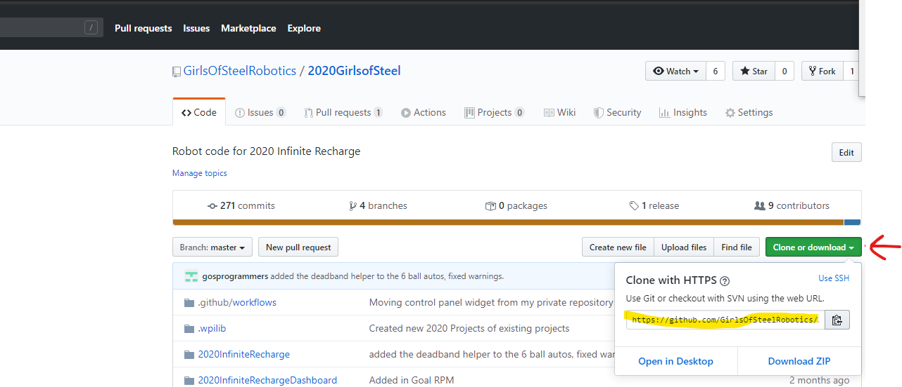
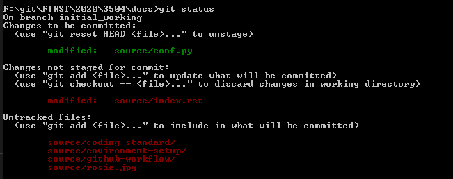

.. _git-cmd:

Git Command Line
================

Because `Real Programmers`_ use the command line

Sometimes there are situations where doing things from the command line are infinitely
easier than trying to use the GUI build into an IDE, so it is a good idea to get some 
of the common commands under your belt.

Clone a repository
-------------------
:code:`git clone <repository url>` is used to download a repository for the very first time. This command should be run in the directory where you want the code to live

The URL can be retrieved from GitHub., i.e

|github-url-example|

.. code-block:: sh

   git clone https://github.com/GirlsOfSteelRobotics/2020GirlsofSteel.git

Get the latest from GitHub
--------------------------
TL;DR
Run a :code:`git pull` to get the latest

There are two ways to get the latest updates from Github, a :code:`git fetch` and a :code:`git pull`.

A :code:`git fetch` will download the latest updates for all remote branches, but it will not update your local branch. This is an advanced feature that you will probably not need.

A :code:`git pull` is syntactic sugar, which under the hood runs a :code:`git fetch` followed by a :code:`git merge`. This means that it will download
everything from GitHub, and if you branch is tracking a remote branch, it will update pull in all of those remote changes on top of yours

Switching Branches
------------------
:code:`git checkout <branch name>` will switch from your current branch, to the one you specify. You can use this when you are 
switching between what features you are working on, or to checkout a branch that already exists on the remote, like if you are
picking up from where a teammate left off at the previous meeting.

.. code-block:: sh
   
   git checkout master

Adding the :code:`-b` option will allow you to create a new branch and immediately switch to it. You would do this when
you are starting to work on a branch new issue

.. code-block:: sh

   git checkout -b adding_shooter

Committing Files
----------------
TL;DR, do a commit by 

.. code-block:: sh

   git add *
   git commit -m "My commit message"

There are two steps required when you run a commit. First, you must add your files to the 'index', then you can commit those changes.
You can add all of your changes by running :code:`git add *`, or add files individually by running :code:`git add path/to/my/file.java`.

Then, you can run a :code:`git commit`. Running that will bring up open a new window so you can enter in your commit message, or
you can specify the commit message right away by running :code:`git commit -m "My Commit Message"`

Pushing code to GitHub
----------------------
Running a :code:`git push` will publish your changes to GitHub.

If you are on a branch new feature branch which has never been pushed before, you might see an error like this. Simply copy
the suggestion they give you, and run that command

.. code-block:: sh

   F:\git\FIRST\2020\3504\2020GirlsOfSteel>git push
   fatal: The current branch example_branch has no upstream branch.
   To push the current branch and set the remote as upstream, use

      git push --set-upstream origin example_branch

Look at your current status
---------------------------
Running a :code:`git status` will show you all of the new/deleted/changes files you currently have that have not been committed.
It will also tell you important information when you are in the middle of a merge that has conflicts.
|git-status|

.. _Real Programmers: https://xkcd.com/378/

Merging Branches
----------------
:code:`git merge <branch name>` will merge all of commits from that branch with yours. This important when your feature
branch is out of date, and you need to get the latest stuff from master. When we merge a Pull Request, GitHub is running
this command for us to get your features back into master.

Note that there might be conflicts when you run the merge. It is your responsibility to fix these issues and retest your code
before we can approve your PR and merge it into master

.. code-block:: sh

   git merge origin/master

When you are in the middle of a merge that has a conflict and decide you want to deal with it later, you can abort the merge by running

.. code-block:: sh

   git merge --abort

Resetting
---------
Sometimes in the course of working or merging, you realize that you messed something up, or you only have made debugging changes
that you don't want to commit, so you can run a :code:`git reset` to obliterate the changes.

NOTE: When you run a reset, your changes are gone forever, there is no 'undo' button

:code:`git reset --hard`